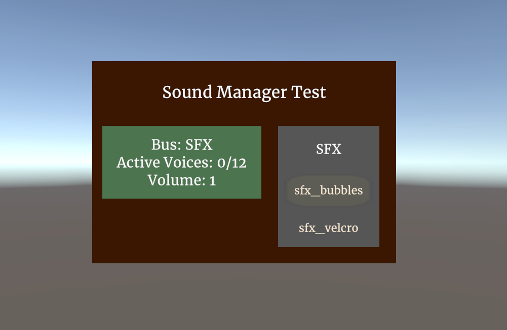
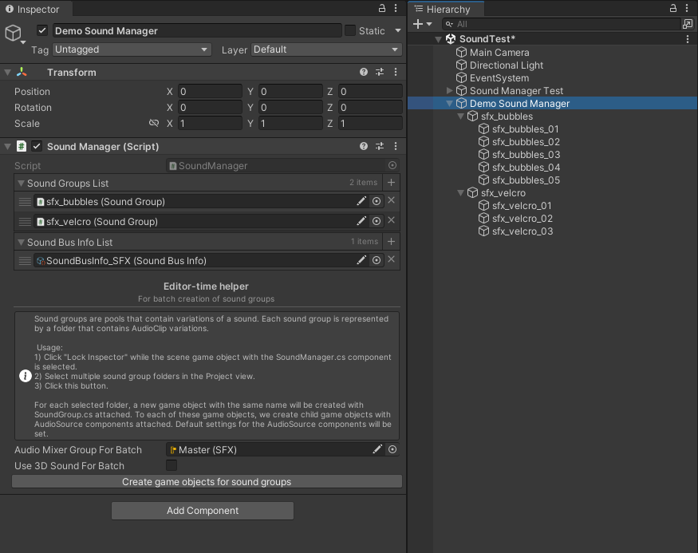
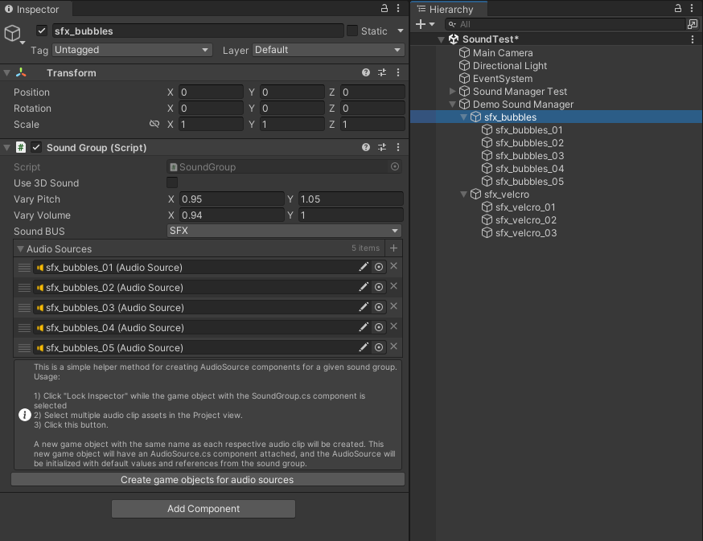
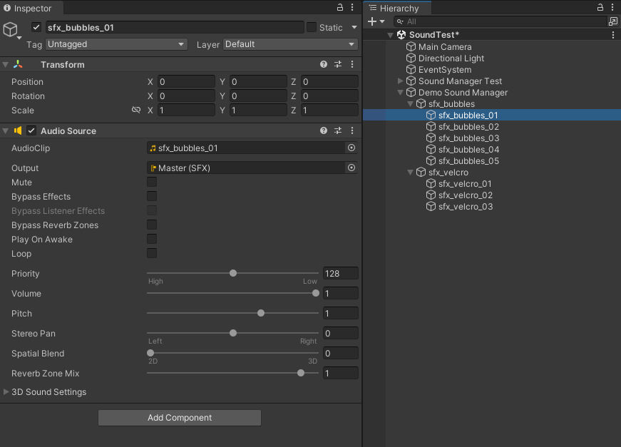

# SoundManager

The sound manager is a singleton, and is parent to objects with SoundGroup.cs components. We organize sound into groups, where each group is a small collection of variations. The sound manager has a method for playing 2d or 3d sound. For demonstration, two sound effects are included: bubbles and velcro. 

We play sounds from anywhere by writing, 

`SoundManager.Instance.PlaySound("sfx_bubbles");` 

or 

`SoundManager.Instance.PlaySound("sfx_bubbles", tranformPlaySoundHere);`

Sound groups are assigned to a sound bus, which limits voices and sets volume. 

Each sound group is parent to multiple game objects with AudioSource components. Each AudioSource component is given a different variations of the sound. Sound groups pool these audio sources toghether. Optionally, sound groups may vary pitch and volume when playing sounds.

Game objects with audio source components only contain Unity's usual audio source. Some manual configuration may be necessary.